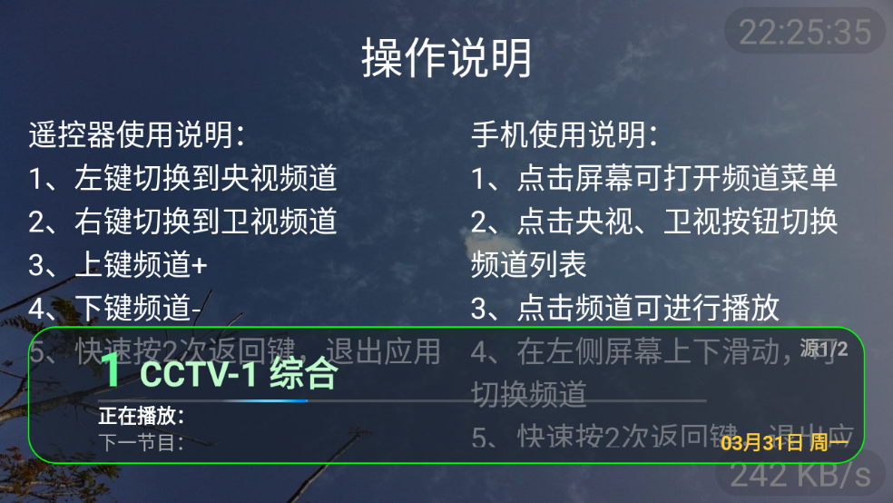
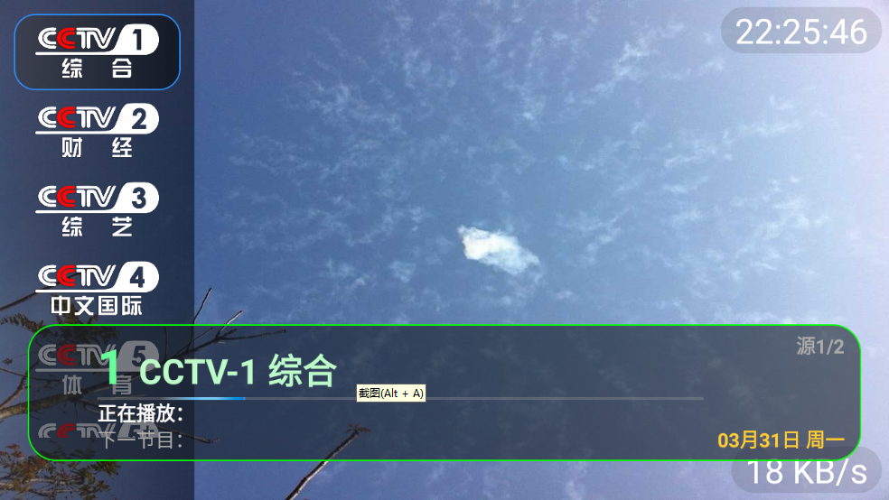
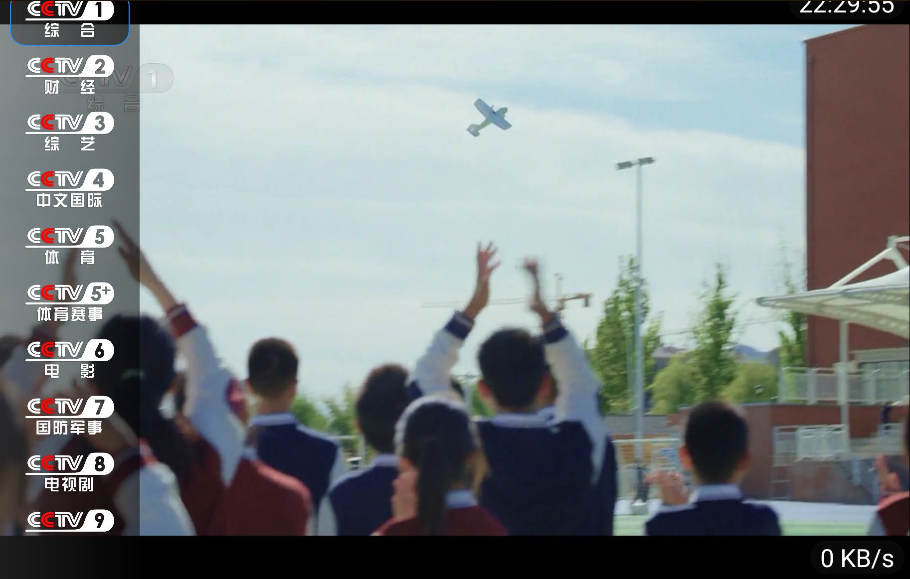
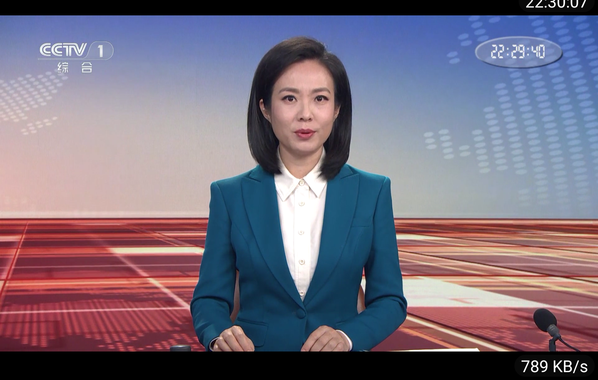

方便 长辈看电视
 
加载官方提供直播源，由于是官方提供的，受网络等因素等原因 加载会需要一点时间。
 
好处是官方提供直播源，不用担心直播源维护问题 而突然不能观看。
 
 

 

 

 

 

功能
 
自动更新频道列表
 
多直播源
 
播放异常自动换源/刷新
 
应用自定义设置
 
适配手机、平板和电视
 
 

优势
 
直接使用官网直播链接，非常稳定可靠
 
兼容 m3u8 链接
 
 
局限
 
比起直接加载直播源，载入频道稍长，需要等待一定时间
 
使用的是官方提供直播源，对设备性能有一定的要求
 
对低版本 Android 设备兼容性比较差，建议 Android 9 或以上的设备
 
官网直播，无法选择视频清晰度，大部分为720P
 
官网直播，帧率有限，大部分为24FPS
 
